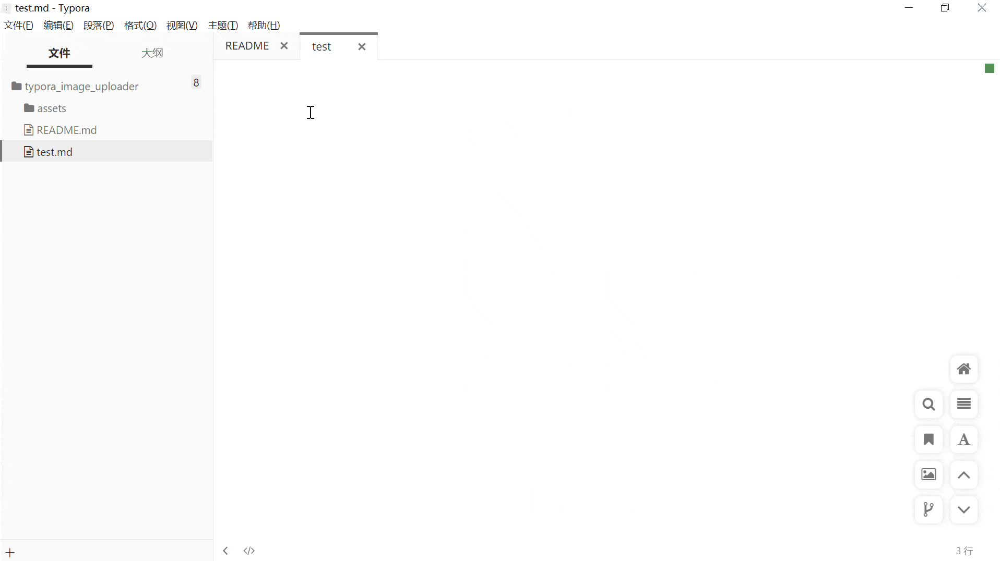
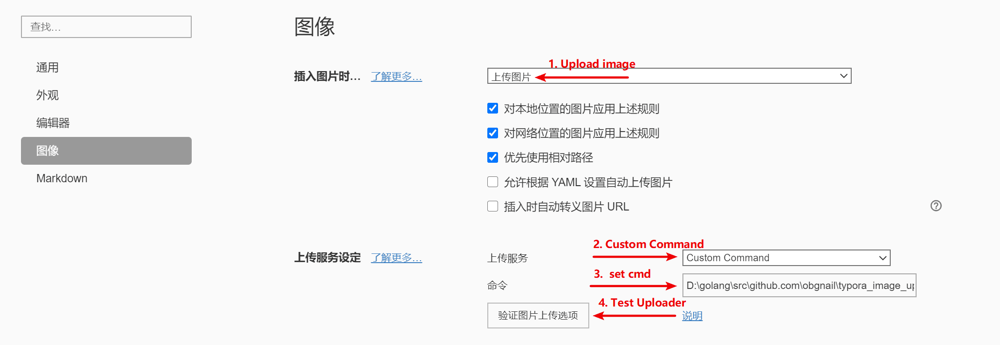
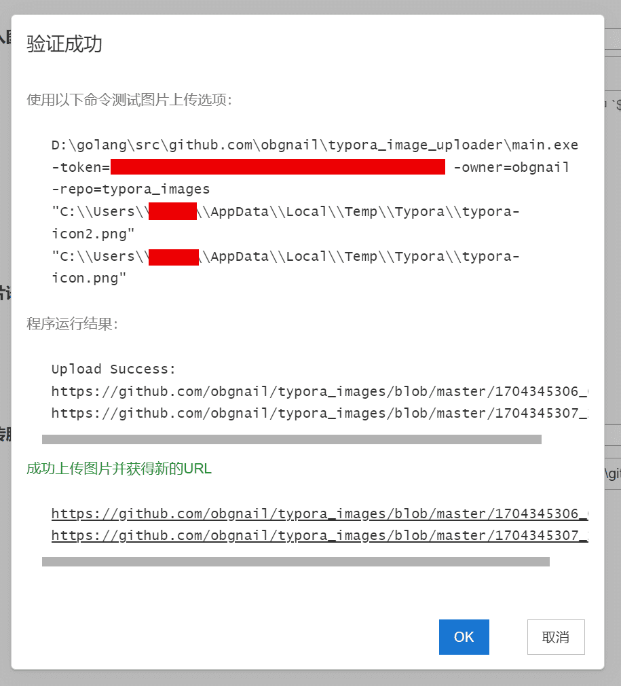

# typora_image_uploader

<div align="center">
  
</div>


## intro

auto upload image in Typora to github repository




## usage

1. create a repository as picture bed in github

2. [create a github personal access token](https://docs.github.com/en/authentication/keeping-your-account-and-data-secure/managing-your-personal-access-tokens#creating-a-personal-access-token-classic)

3. download binary file based on your platform from [release](https://github.com/obgnail/typora_image_uploader/releases/latest)

4. refer to the picture below and set `Custom Command` on the Typora Preferences page

   ```sh
   # need 3 args:
   #   token: access token obtained in step 2
   #   owner: your user name in github
   #   repo : the name of the repository created in step 1
   your/path/to/imageUploader_windows_amd64.exe -token=your_token -owner=your_user_name_in_github -repo=your_repo_name
   ```








> NOTE：MacOS(especially M-series chips) requires executable permission for this file. Please run the command `chmod a+x your/path/to/imageUploader_macos_arm64` before step 4
